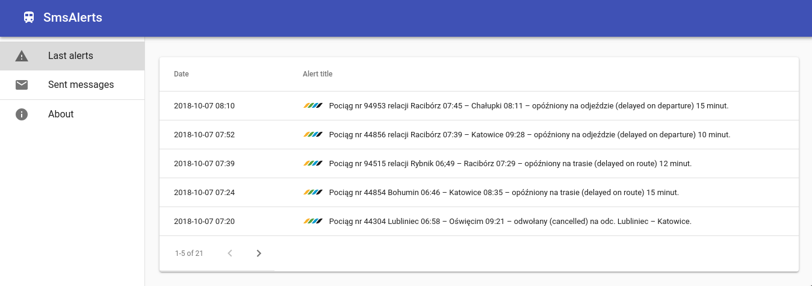

# SmsAlerts

## What is this?

This is a small app I used for monitoring info.kolejeslaskie.com webpage, when I was travelling by train a lot a few years ago. Delays and train/infrastructure problems in Silesian Railways happen pretty often, so I made an app that monitors and scrapes this informational webpage. If it finds an occurence of any given preset keywords (which are basically my destination station names) it sends SMS to given phone number with alert's title.

## How it works?

* Java backend application is periodically scraping Silesian Railways information website, storing locally every entry about train network issues
* For each of the entries containing a predefined set of keywords (like city name where I live) it sends SMS messages to my phone
* React frontend can be used to review the history of train failures and SMS messages that were sent to me

## Technology stack

* Spring, Spock for testing
* AWS SDK for SNS integration
* custom integration with bramkasms.pl for backup SMS sending service
* React for frontend

